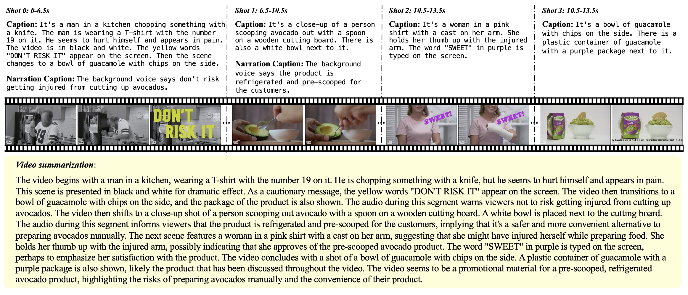

# Shot2Story: A New Benchmark for Comprehensive Understanding of Multi-shot Videos

We are excited to release a new video-text benchmark and extendable codes for multi-shot video understanding. Our 20k version of dataset includes detailed long summaries for 20k videos and shot captions for 80k video shots. Please see [DATA.md](./DATA.md) for more details. 

**Stay tuned for more exciting data release and new features!**

      

## Table of Contents

1. [Introduction](#introduction)
2. [🌟 What's new 👀](#news)
3. [Dataset Glance](#dataset-glance)
4. [Baselines and Tasks](#baselines)
5. [Demo](#demo)
6. [License](#license)
7. [Citation](#citation)
8. [Contact](#contact)

---

## Introduction 

<!-- This section provides a brief overview of the dataset, its purpose, and its potential applications. It also includes a brief history of the dataset's creation and any changes or updates that have been made over time. -->
A short clip of video may contain progression of multiple events and an interesting story line. A human needs to capture both the event in every shot and associate them together to understand the story behind it. In this work, we present a new multi-shot video understanding benchmark Shot2Story with detailed shot-level captions and comprehensive video summaries. To facilitate better semantic understanding of videos, we provide captions for both visual signals and human narrations. We design several distinct tasks including single-shot video and narration captioning, multi-shot video summarization, and video retrieval with shot descriptions. Preliminary experiments show some challenges to generate a long and comprehensive video summary.

---

## What's new 👀 

<!-- This section includes any recent updates or changes to the dataset. It may also include information about related events or projects, such as challenges or competitions using the dataset. This section is frequently updated, so please check back often for the latest news. -->
🌟 Update (16/12/2023): We are excited to release our demo for SUM-shot model. It showcases the power and versatility of detailed and grounded video summaries. Dive into the demo and share your experiences with us! Chat-SUM-shot is on the way! Stay tuned!🎥📝🚀

🌟 Update (12/12/2023): We are excited to release our code for video summarization and video captioning as part of the Shot2Story project. Dive into these new features and share your experiences with us! 🎥📝🚀

🌟 Update (30/11/2023): We are thrilled to announce the release of Shot2Story-20K. Check them out and let us know your thoughts. Stay tuned for more exciting updates! 💫🚀

---

## Dataset Glance 

Our dataset comprises 20k video clips sourced from HD-VILA-100M. Each clip is meticulously annotated with single-shot video captions, narration captions, video summaries, extracted ASR texts, and shot transitions. Please refer to [DATA.md](./DATA.md) for video and annotation preparation.

The dataset includes an average of 4.0 shots per video, resulting in a total of 80k video shots, each with detailed video caption and narration caption annotations. The average length of our video summaries is 201.8, while the average length of a video is 16s.

For more comprehensive details, please refer to the plots below.

     
    
     

---

## Baselines and Tasks 

To benchmark the advances of multi-modal video understanding, we designed several distinctive tasks using our dataset, including single-shot captioning, multi-shot summarization, and video retrieval with shot description. We design and implemented several baseline models using a frozen vision encoder and an LLM, by prompting the LLM with frame tokens and ASR (Automatic Speech Recognition) text. Please refer to 
[./code/README.md](./code/README.md) for running the project.

     
    
     

---

## Demo 

We build a demo for SUM-shot model hosted in [Space](https://huggingface.co/spaces/mhan/Shot2Story). Please have a look and explore what it is capable of. Issues are welcomed! **Chat-SUM-shot model is on the way!**

Some hints to play with our demo: 
*   Various shot structures derive different understanding of the video. We enable automatic shot detection with TransNetv2 and pyscenedetection and also manual specification. Give it a try! 🚀
*   Setting temperature to 0.1 for the most grounded understanding and question-answering.
*   Setting temperature to greater value for the creative grounded understanding and question-answering.
  
<video controls>
  <source src="assets/gradio_demo_final.mov" type="video/mov">
Your browser does not support the video tag.
</video>

---

## License 

Our code is licensed under a [Apache 2.0 License](https://www.apache.org/licenses/LICENSE-2.0.txt). 

Our text annotations are released under a [Creative Commons Attribution-NonCommercial-ShareAlike 4.0 International (CC BY-NC-SA 4.0) License](https://creativecommons.org/licenses/by-nc-sa/4.0/). They are available strictly for non-commercial research. More guidelines of dataset can be found in [here](./DATA.md#license).

<!-- ---

## Citation 

This section provides a suggested citation for users who use the dataset in their work. It includes the names of the dataset's creators, the year of creation, and any other relevant details. It may also include a BibTeX entry for users who are writing academic papers. -->

<!-- ## Acknowledgements  -->

---

## Contact 

If you have any questions or concerns about our dataset, please don't hesitate to contact us. You can raise an issue or reach us at hanmingfei@bytedance.com. We welcome feedback and are always looking to improve our dataset.

---

<!-- This README is intended to be a comprehensive guide to the dataset, but it may not cover every detail or use case. Users are encouraged to contact the dataset's creators or maintainers with any questions or concerns. -->

We extend our thanks to the teams behind [HD-VILA-100M](https://github.com/microsoft/XPretrain/blob/main/hd-vila-100m/README.md), [BLIP2](https://github.com/salesforce/LAVIS), [Whisper](https://github.com/openai/whisper), [MiniGPT-4](https://minigpt-4.github.io/), [Vicuna](https://lmsys.org/blog/2023-03-30-vicuna/) and [LLaMA](https://research.facebook.com/publications/llama-open-and-efficient-foundation-language-models/). Our work builds upon their valuable contributions. Please acknowledge these resources in your work.
