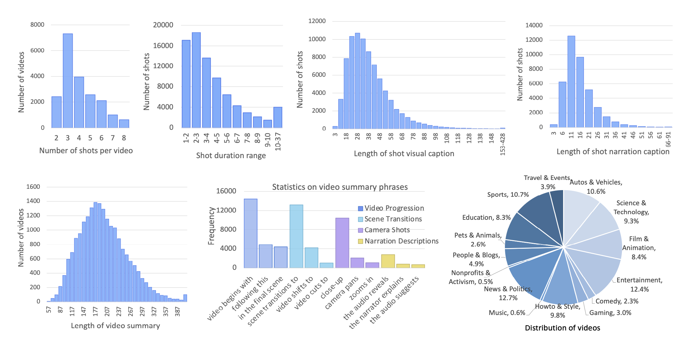

# Shot2Story: A New Benchmark for Comprehensive Understanding of Multi-shot Videos

<a href='https://mingfei.info/shot2story/'></a>
<a href='https://github.com/bytedance/Shot2Story/blob/master/DATA.md'></a>
<a href='https://huggingface.co/spaces/mhan/Shot2Story'></a>
<a href='https://af4cf4e4ce320a8d6c.gradio.live'></a>
<a href='https://arxiv.org/abs/2312.10300'></a>
<a href='https://github.com/bytedance/Shot2Story/tree/master/code'></a>

We are excited to release a new video-text benchmark and extendable codes for multi-shot video understanding. Our updated **134k** version of dataset includes detailed long summaries for **134k videos and shot captions for 188k video shots**.

**Stay tuned for more exciting data release and new features!**

---

## What's new 👀 <a name="news"></a>
🌟 Update (10/06/2024): Please check the release question-answering benchmark [here](https://huggingface.co/datasets/mhan/shot2story/viewer/question-answering). It is designed to benchmark models for multi-shot understanding, w.r.t. temporal-related, holistic-understanding and audio-related aspects.

🌟 Update (05/06/2024): Please check the cached multi-shot videos [here](https://1drv.ms/f/s!Ap3OKt6-X52NgXoG4-64N9WZDenS?e=oIHfkZ). It takes around 160GB of disk space and needs to extract video shots on your own.

🌟 Update (29/04/2024): Please check the issue [here](https://github.com/bytedance/Shot2Story/issues/5) for 134k-version video download assistance. Thanks for the support from the community.
<!-- This section includes any recent updates or changes to the dataset. It may also include information about related events or projects, such as challenges or competitions using the dataset. This section is frequently updated, so please check back often for the latest news. -->
🌟 Update (24/04/2024): We release a new [134K version](https://huggingface.co/datasets/mhan/shot2story). 
- It has detailed video text summaries by (43K) human annotation and (90K) GPTV generation, covering over 548k video shots. 
- Val/Test split in different tasks are remained same to 20K version. [Online ChatBot ](https://huggingface.co/spaces/mhan/Shot2Story) has been updated. 🎥📝🚀
- Video textual summary generation demo ([SumBot](https://af4cf4e4ce320a8d6c.gradio.live)) is also online. Have a try to generate detailed description for your video! 🎥📝

🌟 Update (23/04/2024): Please check the issue [here](https://github.com/bytedance/Shot2Story/issues/5) for 20k-version video download assistance. Thanks for the support from the community.

🌟 Update (16/12/2023): [Paper](https://arxiv.org/pdf/2312.10300) and [Demo](https://huggingface.co/spaces/mhan/Shot2Story) for SUM-shot model. It showcases the power and versatility of detailed and grounded video summaries. Dive into the demo and share your experiences with us! **Chat-SUM-shot** is on the way! Stay tuned!🎥📝🚀

🌟 Update (12/12/2023): [Code](https://github.com/bytedance/Shot2Story/tree/master/code) for video summarization and shot captioning, in the sub-directory `code` of this repo. Dive into these new features and share your experiences with us! 🎥📝🚀

🌟 Update (30/11/2023): [Data](https://github.com/bytedance/Shot2Story/blob/master/DATA.md) of [Shot2Story-20K](https://huggingface.co/datasets/mhan/Shot2Story-20K). Check them out and stay tuned for more exciting updates! 💫🚀

---

## Demo <a name="demo"></a>

We build a [ChatBot](https://huggingface.co/spaces/mhan/Shot2Story) demo and a [SUMBot](https://huggingface.co/spaces/mhan/Shot2Story-SUM) demo for SUM-shot model. Please have a look and explore what it is capable of. Issues are welcomed!

Some hints to play with our demo: 

*   🎉 Start with our provided **demo videos**, some of which are sampled from ActivityNet, not included in our training data.
*   🚀 Please upload videos **less than 20MB**. Enjoy!
*   😄 For a more comprehensive understanding, try specifying reasonable starting and ending timestamps for the shots. Enjoy!
*   😄 Setting temperature to 0.1 for the most grounded understanding and question-answering.
*   😄 Setting temperature to greater value for the creative grounded understanding and question-answering.

Multi-round conversation analyzing a humorous video:

https://github.com/bytedance/Shot2Story/assets/18671115/3f86cf2b-ff59-47e6-8d7b-c1273c8ea5bc

Multiple-step minutes-long video analysis:

https://github.com/bytedance/Shot2Story/assets/18671115/42b5c81d-2a49-4668-a2fd-08fe26aeb9fd


---

## Table of Contents

1. [🌟 What's new 👀](#news)
2. [Demo](#demo)
3. [Introduction](#introduction)
4. [Dataset Glance](#dataset-glance)
5. [Baselines and Tasks](#baselines)
6. [License](#license)
7. [Citation](#citation)
8. [Contact](#contact)

---

## Introduction <a name="introduction"></a>

<!-- This section provides a brief overview of the dataset, its purpose, and its potential applications. It also includes a brief history of the dataset's creation and any changes or updates that have been made over time. -->
A short clip of video may contain progression of multiple events and an interesting story line. A human needs to capture both the event in every shot and associate them together to understand the story behind it. In this work, we present a new multi-shot video understanding benchmark Shot2Story with detailed shot-level captions and comprehensive video summaries. To facilitate better semantic understanding of videos, we provide captions for both visual signals and human narrations. We design several distinct tasks including single-shot video and narration captioning, multi-shot video summarization, and video retrieval with shot descriptions. Preliminary experiments show some challenges to generate a long and comprehensive video summary.

<p align="center"> <br>  <br> </p>

---


## Dataset Glance <a name="dataset-glance"></a>

Our dataset comprises 20k video clips sourced from HD-VILA-100M. Each clip is meticulously annotated with single-shot video captions, narration captions, video summaries, extracted ASR texts, and shot transitions. Please refer to [DATA.md](./DATA.md) for video and annotation preparation.

The dataset includes an average of 4.0 shots per video, resulting in a total of 80k video shots, each with detailed video caption and narration caption annotations. The average length of our video summaries is 201.8, while the average length of a video is 16s.

For more comprehensive details, please refer to the plots below.
<p align="center">
    <br>
    
    <br>
<p>

---

## Baselines and Tasks <a name="baselines"></a>

To benchmark the advances of multi-modal video understanding, we designed several distinctive tasks using our dataset, including single-shot captioning, multi-shot summarization, and video retrieval with shot description. We design and implemented several baseline models using a frozen vision encoder and an LLM, by prompting the LLM with frame tokens and ASR (Automatic Speech Recognition) text. 

[Code](./code/README.md) here for running the project.

<p align="center">
    <br>
    
    <br>
<p>


---

## License <a name="license"></a>

Our code is licensed under a [Apache 2.0 License](https://www.apache.org/licenses/LICENSE-2.0.txt). 

Our text annotations are released under a [Creative Commons Attribution-NonCommercial-ShareAlike 4.0 International (CC BY-NC-SA 4.0) License](https://creativecommons.org/licenses/by-nc-sa/4.0/). They are available strictly for non-commercial research. More guidelines of dataset can be found in [here](./DATA.md#license).


---

## Citation <a name="citation"></a>

If you find this repo useful for your research, please consider citing the paper
```
@article{han2023shot2story20k,
      title={Shot2Story20K: A New Benchmark for Comprehensive Understanding of Multi-shot Videos}, 
      author={Mingfei Han and Linjie Yang and Xiaojun Chang and Heng Wang},
      journal={arXiv preprint arXiv:2311.17043},
      year={2023}
}
```

<!-- ## Acknowledgements <a name="acknowledgements"></a> -->


---

## Contact <a name="contact"></a>

If you have any questions or concerns about our dataset, please don't hesitate to contact us. You can raise an issue or reach us at hanmingfei@bytedance.com. We welcome feedback and are always looking to improve our dataset.

---

<!-- This README is intended to be a comprehensive guide to the dataset, but it may not cover every detail or use case. Users are encouraged to contact the dataset's creators or maintainers with any questions or concerns. -->


We extend our thanks to the teams behind [HD-VILA-100M](https://github.com/microsoft/XPretrain/blob/main/hd-vila-100m/README.md), [BLIP2](https://github.com/salesforce/LAVIS), [Whisper](https://github.com/openai/whisper), [MiniGPT-4](https://minigpt-4.github.io/), [Vicuna](https://lmsys.org/blog/2023-03-30-vicuna/) and [LLaMA](https://research.facebook.com/publications/llama-open-and-efficient-foundation-language-models/). Our work builds upon their valuable contributions. Please acknowledge these resources in your work.
