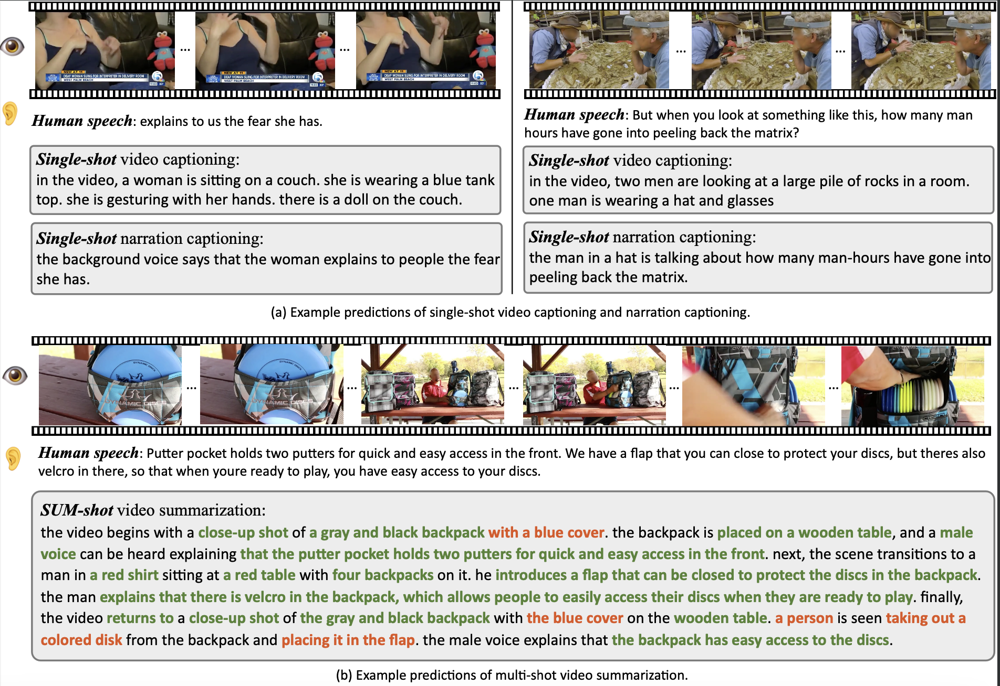

# Shot2Story: A New Benchmark for Comprehensive Understanding of Multi-shot Videos


We are excited to release a new video-text benchmark and extendable codes for multi-shot video understanding. Our 20k version of dataset includes detailed long summaries for 20k videos and shot captions for 80k video shots. Please see [DATA.md](https://huggingface.co/datasets/ByteDance-new/Shot2Story-data) for more details. 

This repo mainly focus on our established baselines for single-shot captions, video summarization, video-shot retrivals and zero-shot video question-answering.

**Stay tuned for more exciting data release and new features!**

<p align="center"> <br>  <br> </p>

## Table of Contents

1. [Introduction](#introduction)
2. [🌟 What's new 👀](#news)
3. [Setting Environment](#setting-environment)
4. [Video Summarization](#video-summarization)
5. [Single-shot Captioning](#single-shot-captioning)
6. [Offline Demo](#offline-demo)
7. [License](#license)
8. [Citation](#citation)
9. [Contact](#contact)

---

## Introduction <a name="introduction"></a>

<!-- This section provides a brief overview of the dataset, its purpose, and its potential applications. It also includes a brief history of the dataset's creation and any changes or updates that have been made over time. -->
A short clip of video may contain progression of multiple events and an interesting story line. A human needs to capture both the event in every shot and associate them together to understand the story behind it. In this work, we present a new multi-shot video understanding benchmark Shot2Story with detailed shot-level captions and comprehensive video summaries. To facilitate better semantic understanding of videos, we provide captions for both visual signals and human narrations. We design several distinct tasks including single-shot video and narration captioning, multi-shot video summarization, and video retrieval with shot descriptions. Preliminary experiments show some challenges to generate a long and comprehensive video summary.

---

## What's new 👀 <a name="news"></a>

<!-- This section includes any recent updates or changes to the dataset. It may also include information about related events or projects, such as challenges or competitions using the dataset. This section is frequently updated, so please check back often for the latest news. -->
🌟 Update (16/12/2023): We are excited to release our [demo](https://huggingface.co/spaces/mhan/Shot2Story) for SUM-shot model. It showcases the power and versatility of detailed and grounded video summaries. Dive into the demo and share your experiences with us! Chat-SUM-shot is on the way! Stay tuned! 📝

🌟 Update (12/12/2023): We are excited to release our code for **video summarization** and **video captioning** as part of the Shot2Story project. Dive into these new features and share your experiences with us! 🎥📝🚀

🌟 Update (30/11/2023): We are thrilled to announce the release of Shot2Story-20K. Check them out and let us know your thoughts. Stay tuned for more exciting updates! 💫🚀


---

## Setting Environment <a name="setting-environment"></a>
This section provides guidelines on how to get the project up and running. Suppose the project root is 
`$project_root/Shot2Story`, then you can prepare the project by:

### Preparing the Data
<!-- **Structure:**   -->
Please follow the instructions in the [DATA.md]() to download and prepare the videos and annotations. In our code, the data should be organized in `$project_root/Shot2Story/data` as below:

```plaintext
data/
|--videos/
|  |--Jz2CSZW7_S4.7.mp4
|  |--Jz2CSZW7_S4.7_0_39.mp4
|  |--Jz2CSZW7_S4.7_40_101.mp4
|  |--Jz2CSZW7_S4.7_102_185.mp4
|  |--Jz2CSZW7_S4.7_186_226.mp4
|  |--Jz2CSZW7_S4.7_227_316.mp4
|  |--Jz2CSZW7_S4.7_317_396.mp4
|  |--...
|
|--annotations/
|  |--20k_train.json
|  |--20k_val.json
|  |--220k_test.json
```
Please use the videos and annotations following their original usage instructions and license.

---

### Python Environment
Our project runs on xx and xx. Use other versions on your own risks.
Please excuate the following commands. We recommand to use conda tool to manage our running environment. 

```code
cd $project_root
git clone https://github.com/bytedance/Shot2Story.git Shot2Story
cd Shot2Story

conda env create -f conda_env.yml
```

### Bash Variables  

Please set `S2S_DIR` in the bash scripts to `$project_root/Shot2Story`; `CONDA_ENV_DIR` to the root directory of the conda environment. We support multi-node distributed training by setting the bash enviroment variables `WORKER_GPU`, `WORKER_NUM`, `WORKER_ID`, `WORKER_0_HOST` and `WORKER_0_PORT`.

---

## Video Summarization  <a name="video-summarization"></a>
The commands and checkpoints in this section corresponds to Section 3.4, Section 6.2 in the [paper]() and more implementation details can be found in Section 8 and codes.

### Training

After setting the python enviroment and the system variable, please run the following command for `SUM-shot`

```code
bash ./exps/summarization/run_SUM_multi_shot.sh 
```

please run the following command for `SUM-holistic`

```code
bash ./exps/summarization/run_SUM_whole_video.sh
```

### Testing and inference

Stay tuned for metric calculation interface and summary generation codes.


### Checkpoints

| Model*            | ASR   | B    | M    | R    | C   | Checkpoint   | 
| ---------------- | ----- | ---- | ---- | ---- | --- | --- |
| SUM-shot w/o ASR | cross | 9.8  | 18.4 | 24.9 | 4.7 | [ckpt]() |
| SUM-holistic     | check | 10.9 | 18.3 | 26.2 | 6.3 | [ckpt](https://huggingface.co/ByteDance-new/shot2story/resolve/main/sum_whole_best_epoch.pth) |
| SUM-shot         | check | 11.7 | 19.7 | 26.8 | 8.6 | [ckpt](https://huggingface.co/ByteDance-new/shot2story/resolve/main/sum_shot_best_epoch.pth) |

*These models are trained in an end-to-end approach. Our provided checkpoint only contains parameter that have been updated, i.e., Q-Former (including additional linear layer).

## Single-shot Captioning  <a name="single-shot-captioning"></a>
The commands and checkpoints in this section corresponds to Section 3.2, Section 3.3, Section 6.1 in the [paper]() and more implementation details can be found in Section 8 and codes.

### Training

After setting the python enviroment and the system variable, please run the following command for `single-shot video captioning`

```code
# with visual signals only
bash ./exps/captioning/run_CAP_v.sh

# with visual and audio signals 
bash ./exps/captioning/run_CAP_av.sh
```

please run the following command for `single-shot narration captioning`

```code
bash ./exps/captioning/run_CAP_a.sh
```

### Testing and inference

Stay tuned for metric calculation interface and summary generation codes.


### Checkpoints
Results for single-shot video captioning:

| Modality* | B    | M    | R    | C    | Checkpoint |
| -------- | ---- | ---- | ---- | ---- | ---------- |
| V        | 10.5 | 16   | 30.1 | 38.8 | [ckpt](https://huggingface.co/ByteDance-new/shot2story/resolve/main/single_shot_v.pth)   |
| V+A      | 10.7 | 16.2 | 29.6 | 37.4 | [ckpt](https://huggingface.co/ByteDance-new/shot2story/resolve/main/shot_av_best_epoch.pth)   |


Results for single-shot narration captioning:

| Modality* | B    | M    | R    | C     | Checkpoint |
| -------- | ---- | ---- | ---- | ----- | ---------- |
| A        | 4.7  | 17.1 | 30.3 | 130.9 | [ckpt]()   |
| V+A      | 18.8 | 24.8 | 39   | 168.7 | [ckpt](https://huggingface.co/ByteDance-new/shot2story/resolve/main/single_shot_audio_av.pth)   |

*These models are trained in an end-to-end approach. V and A means visual signals and ASR text seperately.

## Video-shot Retrieval
Stay tuned!

## Zero-shot video question-answering
Stay tuned!

---

## Offline Demo  <a name="offline-demo"></a>

We provide codes and checkpoints for offline gradio demo on single GPU. The default arguments are set in `demo_video.py`. You can specifiy a different config file by option `--cfg-path`. To excuate on-the-fly shot detection, please download and transfer checkpoint for TransNetv2 to pytorch format, and place it under `./pretrain`. (You can also download it from [here](https://huggingface.co/ByteDance-new/shot2story/resolve/main/transnetv2-pytorch-weights.pth).) 
```code
python demo_video.py
```

---

## License <a name="license"></a>

Our code is licensed under a [Apache 2.0 License](https://www.apache.org/licenses/LICENSE-2.0.txt). 

Our text annotations are released under a [Creative Commons Attribution-NonCommercial-ShareAlike 4.0 International (CC BY-NC-SA 4.0) License](https://creativecommons.org/licenses/by-nc-sa/4.0/). They are available strictly for non-commercial research. More guidelines of dataset can be found in [here](./DATA.md#license).


<!-- ---

## Citation <a name="citation"></a>

This section provides a suggested citation for users who use the dataset in their work. It includes the names of the dataset's creators, the year of creation, and any other relevant details. It may also include a BibTeX entry for users who are writing academic papers. -->

<!-- ## Acknowledgements <a name="acknowledgements"></a> -->


---

## Contact <a name="contact"></a>

If you have any questions or concerns about our dataset, please don't hesitate to contact us. You can raise an issue or reach us at hanmingfei@bytedance.com. We welcome feedback and are always looking to improve our dataset.

---

<!-- This README is intended to be a comprehensive guide to the dataset, but it may not cover every detail or use case. Users are encouraged to contact the dataset's creators or maintainers with any questions or concerns. -->


We extend our thanks to the teams behind [HD-VILA-100M](https://github.com/microsoft/XPretrain/blob/main/hd-vila-100m/README.md), [BLIP2](https://github.com/salesforce/LAVIS), [Whisper](https://github.com/openai/whisper), [MiniGPT-4](https://minigpt-4.github.io/), [Vicuna](https://lmsys.org/blog/2023-03-30-vicuna/) and [LLaMA](https://research.facebook.com/publications/llama-open-and-efficient-foundation-language-models/). Please check original docs of LAVIS repo in [original_docs](./original_docs/). Our work builds upon their valuable contributions. Please acknowledge these resources in your work.